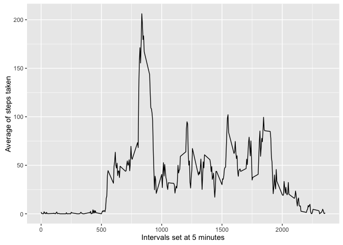
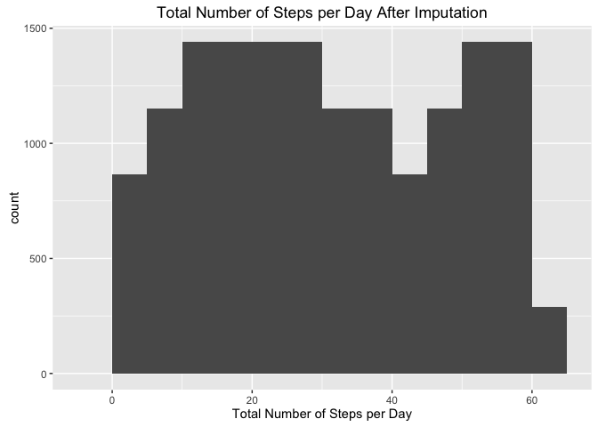

# Reproducible Research: Peer Assessment 1


## Loading and preprocessing the data

```r
library(ggplot2)#needed for plots
library(xtable)#needed for visual presentation of table


 

df.1 <- read.csv("activity.csv")

h.noproc <- head(df.1, 5)
h.noproc <- xtable(h.noproc, caption="First 5 rows: non-processed", label="Head Xtable", digits=1)
print(h.noproc, include.rownames = TRUE, caption.placement="top")
```

```
## % latex table generated in R 3.2.3 by xtable 1.8-2 package
## % Tue May  2 16:25:05 2017
## \begin{table}[ht]
## \centering
## \caption{First 5 rows: non-processed} 
## \label{Head Xtable}
## \begin{tabular}{rrlr}
##   \hline
##  & steps & date & interval \\ 
##   \hline
## 1 &  & 2012-10-01 &  0 \\ 
##   2 &  & 2012-10-01 &  5 \\ 
##   3 &  & 2012-10-01 & 10 \\ 
##   4 &  & 2012-10-01 & 15 \\ 
##   5 &  & 2012-10-01 & 20 \\ 
##    \hline
## \end{tabular}
## \end{table}
```

```r
df <- na.omit(df.1)
h.proc <- head(df, 5)
h.proc <- xtable(h.proc, caption="First 5 rows: processed", label="HeadP Xtable", digits=1)
print(h.proc, include.rownames = TRUE, caption.placement="top")
```

```
## % latex table generated in R 3.2.3 by xtable 1.8-2 package
## % Tue May  2 16:25:05 2017
## \begin{table}[ht]
## \centering
## \caption{First 5 rows: processed} 
## \label{HeadP Xtable}
## \begin{tabular}{rrlr}
##   \hline
##  & steps & date & interval \\ 
##   \hline
## 289 &  0 & 2012-10-02 &  0 \\ 
##   290 &  0 & 2012-10-02 &  5 \\ 
##   291 &  0 & 2012-10-02 & 10 \\ 
##   292 &  0 & 2012-10-02 & 15 \\ 
##   293 &  0 & 2012-10-02 & 20 \\ 
##    \hline
## \end{tabular}
## \end{table}
```
## What is mean total number of steps taken per day?

```r
df.steps <- aggregate(steps ~ date, df, sum)
##Raw Histogram
hist(df.steps$steps, col="lightblue", main = "Histogram of Total # Steps Taken Each Day", 
     xlab="Total Number of Steps in a Day")
```

<!-- -->

```r
##New Bins set
qplot(steps, data=df.steps, binwidth = "1", xlab = "Total number of steps taken each day", 
      main = "Steps with binwidth set at 1", na.rm=TRUE) + 
      geom_histogram(colour="darkgreen", aes(fill = ..count..)) 
```

```
## Warning: Computation failed in `stat_bin()`:
## non-numeric argument to binary operator
```

```
## `stat_bin()` using `bins = 30`. Pick better value with `binwidth`.
```

<!-- -->

```r
mean(df.steps$steps)
```

```
## [1] 10766.19
```

```r
median(df.steps$steps)
```

```
## [1] 10765
```

```r
desc <- summary(df.steps) #from the psych library
desc <- xtable(desc, caption="Summary Statistics for Data", 
               label="Description Xtable", digits=1)
print(desc, include.rownames = TRUE, caption.placement="top")
```

```
## % latex table generated in R 3.2.3 by xtable 1.8-2 package
## % Tue May  2 16:25:05 2017
## \begin{table}[ht]
## \centering
## \caption{Summary Statistics for Data} 
## \label{Description Xtable}
## \begin{tabular}{rll}
##   \hline
##  &         date &     steps \\ 
##   \hline
## 1 & 2012-10-02: 1   & Min.   :   41   \\ 
##   2 & 2012-10-03: 1   & 1st Qu.: 8841   \\ 
##   3 & 2012-10-04: 1   & Median :10765   \\ 
##   4 & 2012-10-05: 1   & Mean   :10766   \\ 
##   5 & 2012-10-06: 1   & 3rd Qu.:13294   \\ 
##   6 & 2012-10-07: 1   & Max.   :21194   \\ 
##   7 & (Other)   :47   &  \\ 
##    \hline
## \end{tabular}
## \end{table}
```
## What is the average daily activity pattern?


```r
library(ggplot2)
df.averages <- aggregate(x=list(steps=df$steps), by=list(interval=df$interval), FUN=mean)
ggplot(data=df.averages, aes(x=interval, y=steps)) + geom_line() + 
  xlab("Intervals set at 5 minutes") + ylab("Average of steps taken")
```

<!-- -->

```r
  df.averages[which.max(df.averages$steps),]
```

```
##     interval    steps
## 104      835 206.1698
```
## Imputing missing values

```r
df.missing <- is.na(df$steps)
num.missing <- sum(df.missing)
table(df.missing)
```

```
## df.missing
## FALSE 
## 15264
```

```r
table (num.missing)
```

```
## num.missing
## 0 
## 1
```

```r
nafiller <- function(steps, interval){
  filler <- NA
  if (!is.na(steps))
    filler <- c(steps)
  else
    filler <- (df.averages[df.averages$interval==interval, "steps"])
  return(filler)
}
myfill.df <- df
myfill.df$steps <- mapply(nafiller, myfill.df$steps, myfill.df$interval)

head(myfill.df)
```

```
##     steps       date interval
## 289     0 2012-10-02        0
## 290     0 2012-10-02        5
## 291     0 2012-10-02       10
## 292     0 2012-10-02       15
## 293     0 2012-10-02       20
## 294     0 2012-10-02       25
```

```r
myts <- tapply(myfill.df$steps, myfill.df$date)


qplot(myts, binwidth=5, xlab="Total Number of Steps per Day",
      main="Total Number of Steps per Day After Imputation" )
```

<!-- -->

```r
library(psych)
```

```
## 
## Attaching package: 'psych'
```

```
## The following objects are masked from 'package:ggplot2':
## 
##     %+%, alpha
```

```r
describe(myts)
```

```
##   vars     n  mean    sd median trimmed   mad min max range skew kurtosis
## 1    1 15264 30.72 17.47     29   30.65 22.24   2  60    58 0.08    -1.26
##     se
## 1 0.14
```

```r
mean(myts)
```

```
## [1] 30.71698
```

```r
median(myts)
```

```
## [1] 29
```

```r
summary(myts)
```

```
##    Min. 1st Qu.  Median    Mean 3rd Qu.    Max. 
##    2.00   16.00   29.00   30.72   47.00   60.00
```

## Are there differences in activity patterns between weekdays and weekends?

```r
week.identify <- function(date){
 day <- weekdays(date)
 if (day %in% c("Monday", "Tuesday", "Wednesday", "Thursday", "Friday"))
   return("Weekday")
 else if (day %in% c("Saturday", "Sunday"))
   return("Weekend")
 else
   stop("Invalid Date")
}  
myfill.df$date <- as.Date(myfill.df$date)
myfill.df$day <- sapply(myfill.df$date, FUN=week.identify)
head(myfill.df$day)
```

```
## [1] "Weekday" "Weekday" "Weekday" "Weekday" "Weekday" "Weekday"
```

```r
avg <- aggregate(steps ~ interval + day, data=myfill.df, mean)
ggplot(avg, aes(interval, steps))+geom_line()+ facet_grid(day ~ .) + xlab("Intervals at 5 minutes") + ylab("# of Steps")
```

<!-- -->
